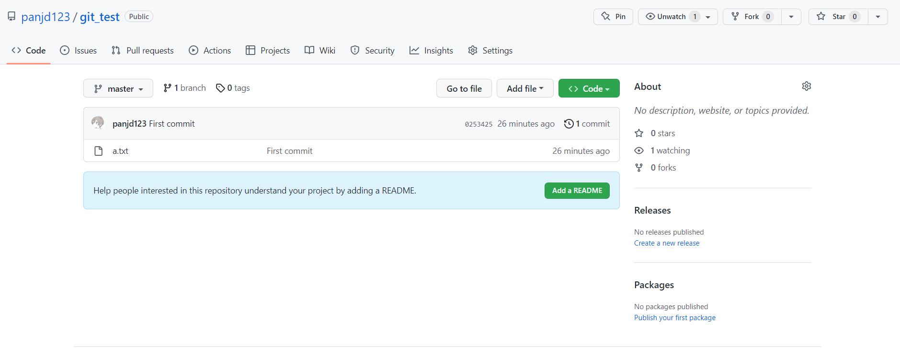
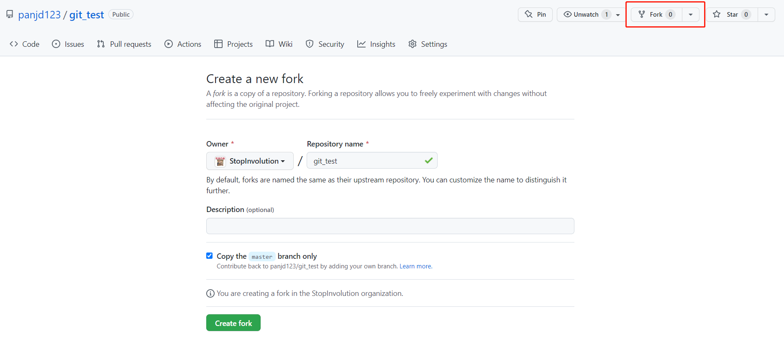
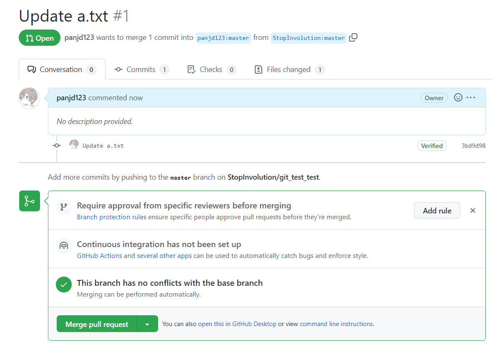
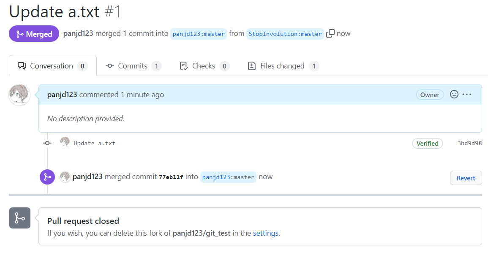
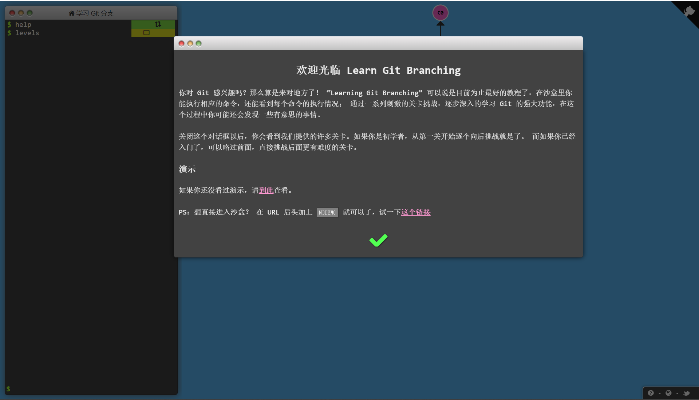

# Git Guidance

## Shell

Git 是一个命令行程序，所以在学习 Git 之前，你有必要简单地了解一下命令行中简单的文件操作。演示操作系统为 Linux。注意，如果你完全没听说过例如 `cd` 这个命令是什么意思，那么你必须先读完这部分，否则你完全没办法做后面的部分。

> 要进入本地命令行，或者说终端，见 [如何在Windows 11中打开Windows终端？有七种方法可供选择](https://baijiahao.baidu.com/s?id=1722119296114582505&wfr=spider&for=pc) 和 [Mac电脑打开终端的三种方法](https://baijiahao.baidu.com/s?id=1742673139907938940&wfr=spider&for=pc)。

> [JS/UIX - Terminal](https://www.masswerk.at/jsuix/index.html) 是一个在线 Linux 终端，你可以用它来暂时体验常见命令。
>
> 1. 进入网站后，点击第二行的 `open terminal`
> 2. 在 `login:` 后随便输入一个用户名，除了 `root`

`man <command>` 展示手册页

```shell
[panjd@www.masswerk.at:2]$ man cp                                               
Synopsis:                                                                       
cp [-ipr] <sourcefile> {<sourcefile>} <target>                                  
                                                                                
copy files from source- to target-file.                                         
                                                                                
Arguments:                                                                      
    <sourcefile>  file(s) or directories to be copied                           
                  if called with multiple source-files the target must be       
                  a directory                                                   
    <target>      the file name of the new file or the name of a directory.     
                                                                                
Options:                                                                        
    -i  ignore error warnings                                                   
    -p  copy file permissions                                                   
    -r  recursive - include nested files
```

> 如何阅读：
> 
> 中括号 `[]` 表示内部的参数可以出现也可以不出现
>
> 短参数 `-i` `-p` `-r`，可以简写在一起 `-ip` 或 `-rip` 之类的
>
> 长参数 `--help`，一般以两个横杠开始，不能缩写
>
> 花括号 `{}` 表示序列，可以输入多个，一条命令只可能有一个参数能输入多个，因为他是靠顺序来判断的，比如 `cp [-ipr] <sourcefile> {<sourcefile>} <target>` 中最后一个参数就是 `<target>`，其他都当做 `<sourcefile>`
>
> 尖括号 `<>` 表示替换，比如 `cp <sourcefile> <target>` 替换后应该是 `cp file1.txt file2.txt` 而不是 `cp <file1.txt> <file2.txt>`

`pwd` 显示当前目录

```shell
[panjd@www.masswerk.at:2]$ pwd                                                  
/home/panjd
```

`mkdir <dirname>` 创建文件夹

`touch <filename>` 创建文件

`ls` 列出当前目录下的文件和文件夹

```shell
[panjd@www.masswerk.at:2]$ mkdir test_dir
[panjd@www.masswerk.at:2]$ touch test_file.txt
[panjd@www.masswerk.at:2]$ ls
test_dir   test_file.txt
```

> 在 Windows 中的 `ls` 是 `dir`，换了个名字。

`cd <dirname>` 切换目录

```shell
[panjd@www.masswerk.at:2]$ cd test_dir
[panjd@www.masswerk.at:2]$ pwd
/home/panjd/test_dir
```

`echo <arg>` 展示 `arg` 的东西

`>` 输出重定向，把本来要输出到终端的输出到文件之类的地方

`cat` 输出文件内容

```shell
[panjd@www.masswerk.at:2]$ echo "hello"
hello                      
[panjd@www.masswerk.at:2]$ echo "hello" > hello.txt
[panjd@www.masswerk.at:2]$ cat hello.txt                                        
hello
```

`rm [-r] <filename>` 删除文件

删除文件夹需要加上参数 `-r` 表示递归地进行，具体见 `man rm`

```
[panjd@www.masswerk.at:2]$ ls                                                   
test_dir   test_file.txt                                                        
[panjd@www.masswerk.at:2]$ rm test_file.txt                                     
[panjd@www.masswerk.at:2]$ rm -r test_dir                                       
[panjd@www.masswerk.at:2]$ ls

```

`cp [-r] <sourcefile> <target>` 复制文件

```
[panjd@www.masswerk.at:2]$ ls                                                   
hello1.txt                                                                      
[panjd@www.masswerk.at:2]$ cp hello1.txt hello2.txt                             
[panjd@www.masswerk.at:2]$ ls                                                   
hello1.txt             hello2.txt
```

`mv <filename> <target>` 移动文件，或重命名文件

```
[panjd@www.masswerk.at:2]$ ls                                                   
hello1.txt             hello2.txt  tmp_dir                                      
[panjd@www.masswerk.at:2]$ mv hello1.txt tmp_dir/hello1.txt                     
[panjd@www.masswerk.at:2]$ ls                                                   
hello2.txt             tmp_dir                                                  
[panjd@www.masswerk.at:2]$ cd tmp_dir                                           
[panjd@www.masswerk.at:2]$ ls                                                   
hello1.txt                                                                      
[panjd@www.masswerk.at:2]$ mv hello1.txt hello3.txt                             
[panjd@www.masswerk.at:2]$ ls                                                   
hello3.txt
```

`clear` 清空屏幕

## Git 简介

Git 是一款开源的版本控制系统。是当下最流行的版本控制系统，如果你不会 Git，你和他人的代码协作将寸步难行。没有程序员可以不学这个工具，除非你打算永远自己造轮子。

所谓版本控制，即记录文件的变化情况，以供查阅甚至回退。如同游戏存档。

> Git 和 GitHub 的关系：GitHub 是一个源代码托管平台，相当于网盘。如果说本地的 Git 只能管理本地文件夹的话，GitHub 就提供了一个所有人都可以访问的远程文件夹，但无论是哪个文件夹，真正在做版本管理的是 Git。

### 一些概念

- Git 需要被初始化在一个文件夹中，一个项目就是一个文件夹，此后这个文件夹内所有的更改都会被版本管理记录。

- 仓库 repository (repo)：在 GitHub 里面，每个项目叫一个仓库。

- pull request (pr)：是 GitHub 中 fork 工作流的一个部分。

- SSH 是用于远程登录（验证身份）的安全协议，GitHub 保护私人项目一般用这种方法检验，未来你们用服务器也会用到这种协议。

  流程：生成一个公钥，一个私钥。公钥上传到服务器，私钥保存在本地。 [非对称加密](https://baike.baidu.com/item/%E9%9D%9E%E5%AF%B9%E7%A7%B0%E5%8A%A0%E5%AF%86)

## Git 和 GitHub 的安装配置

1. 下载安装Git [git-scm](https://git-scm.com/download)
2. 注册 GitHub，可能需要魔法
3. 下载 [GitHub Desktop](https://desktop.github.com/)
4. Git 所有提交需要署名，记得用和 GitHub 注册时一致的邮箱。在命令行输入。

    ```bash
    git config --global user.name "panjd123"
    git config --global user.email "xxxxxxxxx@qq.com"
    ```
5. 配置 SSH
6. 搭配魔法，还需要配置 Git 代理，如果不搭配魔法则不需要

### 配置 SSH

如果你有一个私人项目，不想被人看到，那么 GitHub 可以用 SSH 验证你是否有权限。或者 HTTP，但是那样每次都要输密码。所以这里介绍 SSH。

> 注意：为了避免事后奇怪的问题，除非你确定你在做什么，否则都先配好 SSH 再开始之后的工作。

首先检查一下自己刚才配置的用户名和邮箱 `git config --global --list`。

```shell
jarden@ROG-Flow-X13:~$ git config --global --list
user.name=panjd123
user.email=xxxxxxxxx@qq.com
```

然后生成密钥 `ssh-keygen -t rsa -C "<your_email>"`，记住它说的生成位置。

```
jarden@ROG-Flow-X13:~$ ssh-keygen -t rsa -C "xxxxxxxxx@qq.com"
Generating public/private rsa key pair.
Enter file in which to save the key (/home/jarden/.ssh/id_rsa):
...
```

在对应目录下，有两个文件 `id_rsa`，`id_rsa.pub`，前者就是私钥，后者就是公钥。

打开 GitHub 网站添加公钥：

`右上角` -> `Settings` -> `SSH and GPG keys` -> `SSH keys` -> `new SSH key`

把 `id_rsa.pub` 全文粘贴到 `Key` 里。


然后 `SSH` 就配置完了。

### 配置 Git 代理

GitHub 在国外，很多时候下载速度慢，然而大多数命令行程序都没法直接走系统代理。

```
git config --global http.proxy 'http://127.0.0.1:1080'
git config --global https.proxy 'http://127.0.0.1:1080'
```

设置的方法如上，具体的端口啥的你需要看你的代理软件是怎么设置的。

## Git 入门

首先，我们打开一个文件夹，输入 `git init` 初始化 Git

```shell
jarden@ROG-Flow-X13:~/test_git$ git init
Initialized empty Git repository in /home/jarden/test_git/.git/
```

在 Git 中，每个文件一共有 3 种可能处于的状态：

- 已修改 (modified): 修改了文件，但还没保存到数据库中。
- 已暂存 (staged): 对一个已修改文件的当前版本做了标记，使之包含在下次提交的快照中。
- 已提交 (committed): 数据已经安全地保存在本地数据库中。

这三个状态的转化刚好对应了两个操作: `git add` 和 `git commit`

我们添加一个新文件，并使用 `git status` 获取状态

```shell
jarden@ROG-Flow-X13:~/test_git$ echo "line1" > a.txt
jarden@ROG-Flow-X13:~/test_git$ git status
On branch master

No commits yet

Untracked files:
  (use "git add <file>..." to include in what will be committed)
        a.txt

nothing added to commit but untracked files present (use "git add" to track)
```

这里 `Untracked` 就是指已修改，但是没有被标记。

```shell
jarden@ROG-Flow-X13:~/test_git$ git add a.txt
jarden@ROG-Flow-X13:~/test_git$ git status
On branch master

No commits yet

Changes to be committed:
  (use "git rm --cached <file>..." to unstage)
        new file:   a.txt

```

标记后，它提示我们要么提交，要么撤销，我们提交即可。

`git commit -m <message>`

```shell
jarden@ROG-Flow-X13:~/test_git$ git commit -m "First commit"
[master (root-commit) 0253425] First commit
 1 file changed, 1 insertion(+)
 create mode 100644 a.txt
jarden@ROG-Flow-X13:~/test_git$ git log
commit 02534254fcd52b8873b80f498ab32f00471a8187 (HEAD -> master)
Author: panjd123 <1747366367@qq.com>
Date:   Fri Jan 13 12:14:39 2023 +0800

    First commit
```

> `git commit` 不加任何参数会进入文本编辑器中编写提交记录，如果你处在 Linux 环境中，你可能会进入 `vim` 或者 `nano` 等你不熟悉的命令行编辑器。如果你想暂时避免这个问题，就先用 `git commit -m "xxxx"`，因为除非你需要编辑复杂的正文，否则 `-m` 够用了。
>
> 另外，虽然 Git 是版本控制，但其最小更新单位往往不是一个“版本”，而是有一些变动就 commit 一次，我们一般说的版本，如 1.1.1 之类的，往往会用 `git tag` 来实现，不过这不在本文的讨论范畴中

以上我们成功提交了一次 `commit`，更新信息是 "First commit"，使用 `git log` 可以显示提交历史。

### 和 GitHub 交互

刚刚我们已经成功在本地实现了版本控制，接下来是关于怎么传到 GitHub 上让所有人都可以贡献这个项目。

###  创建一个远程仓库

打开 GitHub，`右上角+号` - > `new repository` 


如果你已经在本地创建好项目了，那这一步推荐什么都不要加，全部选 `None`，另外，如果是大作业，记得选择私有。


我们参考第二栏，在已经创建好的仓库里面输入下面三行：

> 注意：如果使用 ssh 格式的链接，那么无论仓库是不是 public 的，都得配置 ssh。

```shell
git remote add origin git@github.com:panjd123/git_test.git
git branch -M master
git push -u origin master
```

`git remote add <name> <url>`  添加远程仓库，这里我们添加了一个名为 `origin` 的仓库，它的链接是 `git@github.com:panjd123/git_test.git`。

`git branch -M master`   指把当前分支改名为 `master`，事实上可以不这么做，因为这其实是所有 `git` 仓库一开始默认分支的名字，只要你没改过。

`git push <远程主机名> <本地分支名> <远程分支名>`  指将本地仓库更新到服务器。如果远程分支名不写，那么默认和本地一致。这里，我们把本地的 `master` 分支，推到了 `origin` 仓库的同名分支下。`-u` 指保存这个提交关系，以后只要 `git push` 它会按照之前保存的提交关系执行。

最后的结果类似下面，第一次和 GitHub 服务器连接的时候会有一个提示，选择 `yes` 即可。

```shell
jarden@ROG-Flow-X13:~/test_git$ git push -u origin master
The authenticity of host 'github.com (20.205.243.166)' can't be established.
ECDSA key fingerprint is SHA256:p2QAMXNIC1TJYWeIOttrVc98/R1BUFWu3/LiyKgUfQM.
Are you sure you want to continue connecting (yes/no/[fingerprint])? yes
Warning: Permanently added 'github.com,20.205.243.166' (ECDSA) to the list of known hosts.
Enumerating objects: 3, done.
Counting objects: 100% (3/3), done.
Writing objects: 100% (3/3), 211 bytes | 211.00 KiB/s, done.
Total 3 (delta 0), reused 0 (delta 0)
To github.com:panjd123/git_test.git
 * [new branch]      master -> master
Branch 'master' set up to track remote branch 'master' from 'origin'.
```



刷新一下网页，我们就能看到远程服务器我们的文件了。

### 克隆一个远程仓库

点击右上角的 `Code` 会显示项目的链接

> 注意：如果使用 ssh 格式的链接，那么无论仓库是不是 public 的，都得配置 ssh。


如果其他人想下载这个仓库到本地开始协作，就要用到 `git clone <url> `

```shell
jarden@ROG-Flow-X13:~/test$ git clone git@github.com:panjd123/git_test.git
Cloning into 'git_test'...
remote: Enumerating objects: 3, done.
remote: Counting objects: 100% (3/3), done.
remote: Total 3 (delta 0), reused 3 (delta 0), pack-reused 0
Receiving objects: 100% (3/3), done.
```

### 最简单的工作流

现在假设协作的几个人都有了一份这个仓库在本地而且有直接修改权限，那几个人可以直接协作：

每个人各自写各自的代码，正常地 `git commit`，定时用 `git push` 同步到服务器上，而其他人则使用 `git pull` 用服务器上的文件更新本地的。 

一般来说，一开始，`A` 和 `B` 和 `服务器` 上有相同的项目文件。这时候，`A` 先完成了修改，在服务器上提交了一次。`B` 再想提交的时候会报错，当前的项目落后于服务器，此时 `B` 就要在 `git push` 之前先 `git pull` 把别人的修改拉下来更新一下自己的本地仓库，然后再 `git push`

> 权限需要在 GitHub 中操作，通过邀请获得。默认的权限是只读的，你可以根据实际情况改成 `Write` 或更高

### fork 工作流

对于 GitHub 上的大多数开源项目和有一定规模的公司来说，每个人都有项目直接修改权是很可怕的。所以 GitHub 特别地设计了一种 fork 工作流。
允许你分叉或者说复制一份他人的仓库，然后你的所有修改都在这个自己的仓库里，但是我们可以向上游发起合并的请求，将这个 fork 出来的仓库的更新，合并进原来的仓库。



执行 fork 后，服务器上就会复制一个一模一样的远程仓库，而原来的仓库此时被称为 `upstream`。这个被 fork 出来的仓库可以拉取上流仓库来更新。


如果想要用命令行来更新，可以用下面几行代码

```shell
git fetch upstream
git checkout master
git merge upstream/master
```

现在，我们所有的自己的修改就被限制在这个 fork 出来的，属于自己的仓库中了。

我们现在修改一下这个被 fork 出来的仓库，这种简单的工作可以直接在 GitHub 里面用可视化的面板完成，复杂的一般都是在本地用最初的流程来实现。

所谓本地最初的流程，就是利用 `git clone <url>` 先把这个 fork 出来的仓库克隆到本地，然后用 `git add`, `git commit`, `git push` 等方式去修改。

> 注意 task0 中的要求，为了熟悉 Git 的命令行操作，task0 中的工作要全程用命令行处理，熟悉之后你们可以用你们喜欢的方法。

我们在 `a.txt` 中添加了一行 `line2`

然后在你 fork 出来的仓库中点击 `Pull Requests`

现在它帮你显示了你的仓库和上游仓库的区别，而我们想做的是把这个修改提交给上游审核，所以我们点击 `Create pull request`


接着你需要简单写一下你做了什么工作给上游仓库的负责人看。

我这里是什么都没写，然后因为我同时是管理员，所以在我看来，我会看到下方有一个 `Merge pull request` 也就是把它的更新合并到仓库中。

同意后，我们的 `merge` 就完成了。这个 `pull request` 会被关闭。

提示：如果你的提交被拒绝，你不需要重新 `pr` 一次，只要原 `pr` 没被关闭，之后的更新会一直同步在这个 `pr` 里，只要你改好之后再在这个像聊天框一样的 `pr` 界面里反馈一下就行了。





接着我们来看一下本地的情况，因为远程仓库更新了，所以我们需要拉取一下

```shell
jarden@ROG-Flow-X13:~/test/git_test$ git pull
remote: Enumerating objects: 6, done.
remote: Counting objects: 100% (6/6), done.
remote: Compressing objects: 100% (2/2), done.
Unpacking objects: 100% (4/4), 1.21 KiB | 413.00 KiB/s, done.
remote: Total 4 (delta 0), reused 0 (delta 0), pack-reused 0
From github.com:panjd123/git_test
   0253425..77eb11f  master     -> origin/master
Updating 0253425..77eb11f
Fast-forward
 a.txt | 1 +
 1 file changed, 1 insertion(+)
```

可以看到它提示 a.txt 多了一行，我们再输出日志可以看到三件事，一开始的提交，fork 仓库的提交，fork 仓库和本仓库的合并。

```shell
jarden@ROG-Flow-X13:~/test/git_test$ git log
commit 77eb11fe989d5580bc0fbdb34fd888155322996a (HEAD -> master, origin/master, origin/HEAD)
Merge: 0253425 3bd9d98
Author: panjd123 <30641248+panjd123@users.noreply.github.com>
Date:   Fri Jan 13 13:09:36 2023 +0800

    Merge pull request #1 from StopInvolution/master

    Update a.txt

commit 3bd9d98dcc492a4026db0947d66b7ae27c0f97d3
Author: panjd123 <30641248+panjd123@users.noreply.github.com>
Date:   Fri Jan 13 13:04:08 2023 +0800

    Update a.txt

commit 02534254fcd52b8873b80f498ab32f00471a8187
Author: panjd123 <1747366367@qq.com>
Date:   Fri Jan 13 12:14:39 2023 +0800

    First commit
```

## Git 进阶：也是必学哦

我们刚刚其实忽略了很多细节，比如 `git merge` 和 `git branch` 是什么，事实上，这是 `git` 最突出的一个特点，也比较难以掌握。

相比于用冗长的文字，我推荐你用一个沙盒学习网站 [LearnGitBranching](https://learngitbranching.js.org/?locale=zh_CN) 来学习分支是什么，怎么使用。同时，这个网站还有和远程仓库连接相关的内容。



它的指令输入在最左下角，同时它输入的指令可能有所简化。

### 处理冲突

另外，我们还忽略了 Git 是怎么实现合并更新的，如果两个人在修改的是两个地方的代码，或者是分别添加代码，那么 Git 可以自动帮你处理。然而，如果两个人修改的是同一行代码，Git 就没办法抉择了，这种情况就叫做冲突。处理冲突是一个比较麻烦的事情。当发生冲突的时候，冲突的位置会变成下面这样：

```
Git is a distributed version control system.
Git is free software distributed under the GPL.
Git has a mutable index called stage.
Git tracks changes of files.
<<<<<<< HEAD
Creating a new branch is quick & simple.
=======
Creating a new branch is quick AND simple.
>>>>>>> feature1
```

你需要手动地选择或重构由 `<<<<<<<` 和 `>>>>>>>` 两行包围起来的冲突部分，比如我重构成了

```
Git is a distributed version control system.
Git is free software distributed under the GPL.
Git has a mutable index called stage.
Git tracks changes of files.
Creating a new branch is quick and simple.
```

此时，`git add` 再 `git commit` 就可以合并了。

在进一步学习冲突之前，你需要先大致理解之前提到的 `merge` 和 `branch` 是怎么一回事。在学习完那个沙盒之后，你可以故意制造一些冲突实验，或者在互联网上寻找相关的补充资料。

> 你一定会或多或少遇到冲突的，除非你是神仙，或者你们全是一个人在写

#### 如何避免冲突

处理冲突的最好方法就是避免冲突，要避免两个人同时修改一段代码，首先要做到代码功能足够地分开，同时尽量多文件，不要挤在一个文件里，最后是频繁地 `git push` 和 `git pull` 与他人同步。

[知乎：如何克服解决 Git 冲突的恐惧症](https://www.zhihu.com/question/27507789/answer/212824418)

## Git 的其他知识

### 怎么删除文件

在 Git 中，移动，重命名和删文件并不是那么简单的事情。最常见的情况就是如果你直接在文件资源管理器中删掉了一个文件，并且 `push` 到了 GitHub，然而 GitHub 上看这个文件仍然存在。

为了保证 Git 能正确追踪，你需要用 `git rm` 和 `git mv` 来替代 `rm` 和 `mv` 或一般文件资源管理器做的事情。

或者其他的办法，见 ["git rm" 和 "rm" 的区别](https://blog.csdn.net/csflvcxx/article/details/78770446)

### .gitignore

通过正则匹配，你可以用 `git add .` 的方式来快速把所有修改都加入下一次 `commit` 中。

不过有时候，你的文件夹里有一些临时文件，不用被 Git 管理，更不希望传到服务器上，你可以创建一个名为 `.gitignore` 的文件在仓库一级目录下

比如，我想要 Git 忽略 `/test` 文件夹下的内容，和所有 Python 脚本，我可以添加这样两条记录，这样以后 Git 就不会理睬这些文件了，我也不用担心误提交。

```
/test
*.py
```

### commit 记录怎么写

`git commit` 的时候，[基本的格式](https://blog.csdn.net/xlinsist/article/details/54933623)和内容都很重要，如果这个项目要给别人看和理解，那就请不要随便地对待这一件事。

你应该写具体的内容，比如更新了什么功能或修改了什么Bug，而不是更新了A文件。如果内容太多，那么应该写个概括的标题，并在 commit 的正文里补充完整的更新内容。

在 Windows 下，你可以配置 Git 的默认编辑器为 VSCode 之类的，然后只 `git commit` 。打开的文件就是待提交的 commit 记录，第一行的标题，空一行，第二行开始就是正文。

### GitHub创建组织

在 GitHub 中，可以几个人创建一个组织，以组织的名义管理仓库。位置在右上角的加号 -> `New organazation`

### 一些提醒

谨慎开启IDE中的自动格式化功能，这可能导致你把别人的代码段全部重写，最后 Git 就会标出一大堆修改。

如果要开启，你们应该约定同一种格式化标准，比如 VSCode 中我的配置是：

```json
"C_Cpp.clang_format_style":"{ BasedOnStyle: Chromium, IndentWidth: 4}"
```
