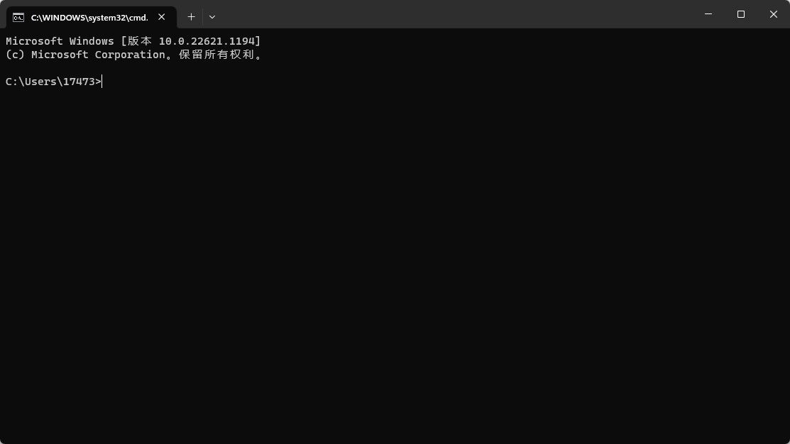

# 3月7日上机课

## 阶段0 回顾

### commit message

`commit message` 应该写改动的内容。

和库管理员交流的语句应该是放在 `pr` 的评论里。

### 命令行界面 Command-line interface(CLI)

命令行界面是在图形用户界面得到普及之前使用最为广泛的用户界面，输入命令，然后回车，就会执行命令。命令行本质上是和图形界面中点点划划平行的一种操作计算机的逻辑。

使用 Git 并不是只能用 `Git Bash`，
`git` 是安装在电脑上的，而不是在 `Git Bash` 里的，所以任何命令行界面都可以用 `Git`，比如 `Windows PowerShell`，`cmd`，`Linux` 的 `bash` 等等。

如果用过 `dev-c++`，那么 `cmd` 就不陌生了，它就是每次运行的时候弹出来的黑框框。

> 不过不同的命令行，它的显示内容可能不一样，比如 `Git Bash` 里就额外显示了很多 `git` 相关的信息。



## 大作业

[overview](../../task/1.1-overview.md) 里已经对大作业整体要求做了很详细的说明，以下是一些强调。

### 工作流

我们要求用 Git 协作，具体工作流任意，比如你们可以每个人全在同一个 branch 上开发，或者每个人开一个 branch 再合并，或者你们也可以用 fork 工作流。

### 面向对象编程

我们要求面向对象编程，尽量用类，如果你不用类来写我们视作没有按规定完成大作业，会扣分。

具体地，例如棋盘，玩家，棋子各是一类，你可以参考下图，其中虚线表示包含关系，实线表示继承关系，圈箭头表示功能。


### 代码风格

一般情况下，工业中不写

```cpp
void mergeSet(std::set< std::pair<int,int> > &x, std::set< std::pair<int,int> > &y);
```

这种风格的代码，你可以考虑写成

```cpp
// 气
using Liberty = std::pair<int, int>;

// 连通块周围的气的集合
using LibertySet = std::set<Liberty>;

// 合并两个气集合
void mergeSet(LibertySet &x, LibertySet &y);
```

但这不是必须的，对于比较简单的项目，这么写对于开发人员可能是负担。

但如果你考虑代码的可读性，后人能否维护等等，这么写是有必要的。

例如当你的代码复杂到这样的时候：

```cpp
template <typename T>
using IsNotStdArray = std::negation<IsStdArrayImpl<std::decay_t<T>>>;

template <typename T>
using IsNotCArray = std::negation<std::is_array<std::remove_reference_t<T>>>;

template <typename From, typename To>
using IsLegalDataConversion = std::is_convertible<From (*)[], To (*)[]>;

template <typename Iter, typename T>
using IteratorHasConvertibleReferenceType =
    IsLegalDataConversion<std::remove_reference_t<iter_reference_t<Iter>>, T>;

template <typename Iter, typename T>
using EnableIfCompatibleContiguousIterator = std::enable_if_t<
    std::conjunction<IsContiguousIterator<Iter>,
                     IteratorHasConvertibleReferenceType<Iter, T>>::value>;

template <typename Container, typename T>
using ContainerHasConvertibleData = IsLegalDataConversion<
    std::remove_pointer_t<decltype(std::data(std::declval<Container>()))>,
    T>;

template <typename Container>
using ContainerHasIntegralSize =
    std::is_integral<decltype(std::size(std::declval<Container>()))>;

template <typename From, size_t FromExtent, typename To, size_t ToExtent>
using EnableIfLegalSpanConversion =
    std::enable_if_t<(ToExtent == dynamic_extent || ToExtent == FromExtent) &&
                     IsLegalDataConversion<From, To>::value>;

// SFINAE check if Array can be converted to a span<T>.
template <typename Array, typename T, size_t Extent>
using EnableIfSpanCompatibleArray =
    std::enable_if_t<(Extent == dynamic_extent ||
                      Extent == internal::Extent<Array>::value) &&
                     ContainerHasConvertibleData<Array, T>::value>;
```

> 以上是 chromium 的[源代码节选](https://source.chromium.org/chromium/chromium/src/+/main:base/containers/span.h)，chromium 就是 Google Chrome 的开源版本。如今的 Edge, 360 极速浏览器等等都是基于 chromium 开发的。其开发语言是 C++，这个项目的源代码有几个 G。

## 阶段1

简单说，这一阶段的任务就是写一个规则完善的不围棋。不用考虑网络，AI，或者非规则内的基本内容。

另外，因为第一阶段结束之后，第二阶段可能会撞上期中考，所以你可以考虑提前做一点第二阶段。
