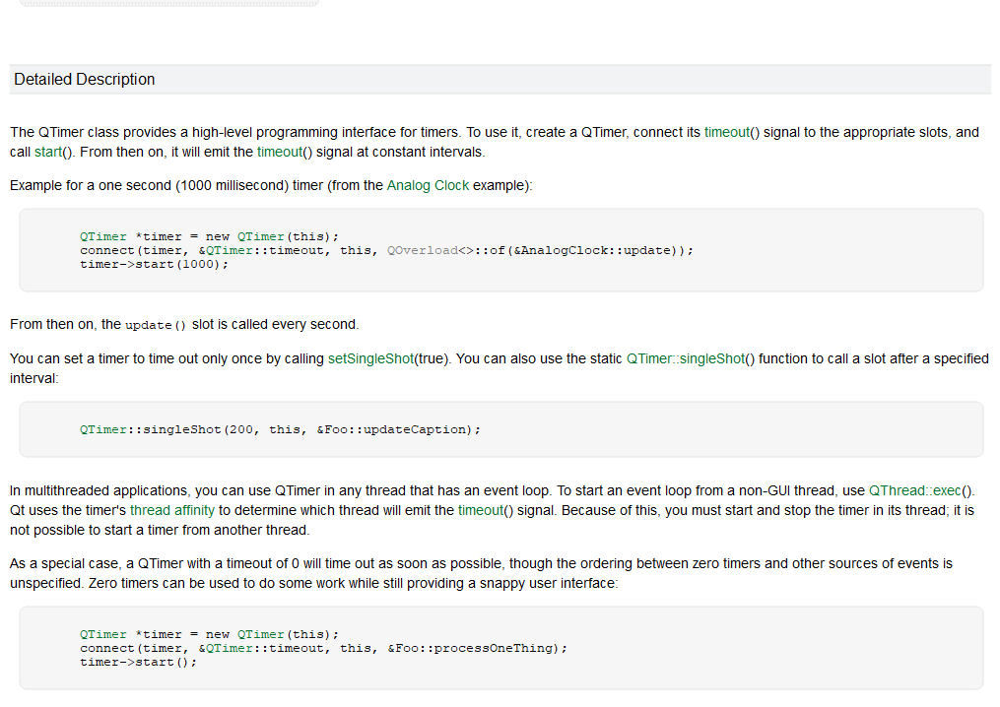
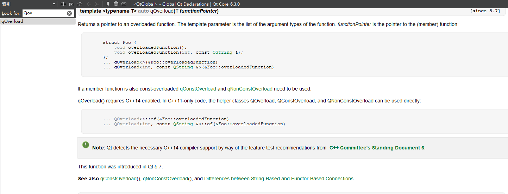

# 3月14日上机课

## QTimer

任何时候，官方文档都是最好的参考。它说 `QTimer` 会定时发送一个 `timeout` 信号。所以下棋超时你就可以写个超时处理函数，然后把这个 `timeout` 信号和这个函数连接起来就可以了。

然后你需要注意两点：

- 如果超时了，那么你要把当前这个 `timer` 停掉，否则下一个周期它又超时一次，要避免这件事你可以看它下来提供了只触发一次的 `singleShot` 函数。

- 如果没有超时，那么你要在他下棋后把提前把当前这个 `timer` 停掉，然后下一个人重新 `start`。

> 思考：如果要显示倒计时，你应该怎么做？



有时候文档看不懂，比如你看到

```cpp
connect(timer, &QTimer::timeout, this, QOverload<>::of(&AnalogClock::update));
```

一方面你可以接着查 `QOverload<>::of` 是啥，不过模板还没教，所以你可能会看不懂具体怎么回事。简单来说，它是用来区分同名不同参数的重载函数的，通过模板指定参数来获取对应的函数指针。



但话说回来，其实你已经知道 `connect` 的作用了，所以右边肯定是一个函数指针，它具体是什么我们并没有必要知道，我们本来就只是关心和 `timer` 有关的内容，也就是 `QTimer::timeout`，你把它在脑袋里面简化一下 `connect(timer, &QTimer::timeout, this, &AnalogClock::update);`，这样就很好理解了。

读文档的时候大胆假设，小心求证，这样你才可以快速了解一个东西的用法，然后不在意具体的实现细节。

## .DS_Store for macOS users

你不应该把 `.DS_Store` 这种无关文件提交到 git 仓库里面，具体见：

https://feyoudao.cn/pages/9f8029

## 大作业中的全局变量

根据之前的经验，会有很多组为了省事，把大量本该封装的变量放在全局里面，恨不得所有变量都是全局，到处都能随便调用才好，这样的问题是：

一方面这可能污染了全局命名空间，另一方面会降低代码的[可移植性](https://zh-google-styleguide.readthedocs.io/en/latest/google-cpp-styleguide/scoping/#section-6)，当然最重要的是，这不符合面向对象的思想。

总之，这不是一个好做法，你应该尽量避免这种情况。

> Google C++ Style Guide 中禁止了定义非 POD 的全局变量，所谓 POD 类型就是 `int`、`double`、`char` 等，而 `std::string`、`std::vector` 以及几乎所有你自己定义的类都不是 POD 类型。
>
> 详见：https://en.cppreference.com/w/cpp/named_req/StandardLayoutType

## 其他有用的参考资料

我把 code-style 文件夹改名成了 cpp，然后加了一个 [`cpp.md`](../cpp/cpp.md)，里面有一些和 C++ 有关的资料，你可以看看。