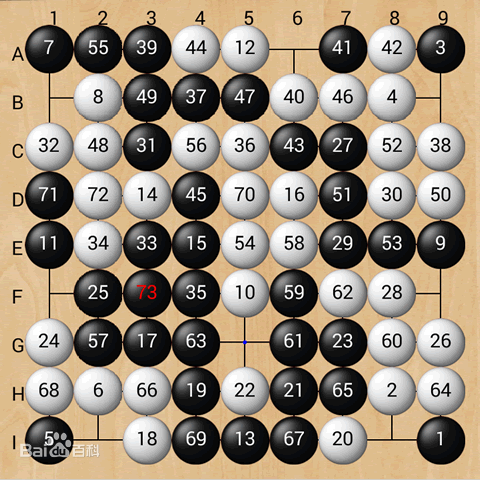

# 不围棋

## 规则

- 9路棋盘
- 黑子先手，双方轮流落子，落子后棋子不可移动
- 每个棋子上下左右的空称为气
- 上下左右相邻的同色棋子组成一个整体，共享气。例如下图中最左上角的一块 {7,55,39,49,37,47,31} 是一个整体，他们的气只剩下 B1
- 如果棋子没有气了，就会被吃。落子后同时没气，则是对方被吃。
- 如果一方落子后吃掉了对方的棋子，则落子一方判负（顾名不围棋）
- 对弈禁止自杀，落子自杀一方判负
- 对弈禁止空手(pass)，空手一方判负
- 注意：不可能平手，无处落子时只能认输或者自杀

## 背景

不围棋（NoGo），又译作阙棋，是John Moore在2005年推出的两人围棋变体，以让对方先提棋子为胜，在2011年、2013年为奥林匹亚电脑游戏程式竞赛项目，也是2012年中国全国大学生计算机博弈大赛的指定棋类。

## 常见的棋类博弈算法

- 贪心：设计一个启发式估值函数，选择最大的一步
- 博弈树，minmax搜索，alpha-beta剪枝：https://blog.csdn.net/moonlight11111/article/details/124208342
- 蒙特卡洛搜索树(MCTS)，UCT：https://blog.csdn.net/m0_46413065/article/details/115525027
- AlphaGo系列：这似乎算"常见"，但似乎不那么"常见"。本质上是MCTS和深度学习的结合。[AlphaGo详解](https://zhuanlan.zhihu.com/p/423253822)，需要了解一点点强化学习中的概念。

> 本实验最多做到 min-max 就行，别太卷，以后会有一门编程集训进一步接触。

### 估值函数

例如在五子棋中，可以加权统计棋盘中 oo,ooxo 等的数量；在跳棋中可以直接按照前进的多少，或者是给位置加权，终点的权值最高。

### 不围棋AI研究

郭倩宇, 陈优广. 基于价值评估的不围棋递归算法[J]. 华东师范大学学报 (自然科学版), 2019, 1: 58-65.

梁国军, 谢垂益, 胡伶俐, 等. UCT 算法在不围棋博弈中的实现[J]. 韶关学院学报, 2015, 36(8): 17-21.

> 借鉴其中的估值函数即可
