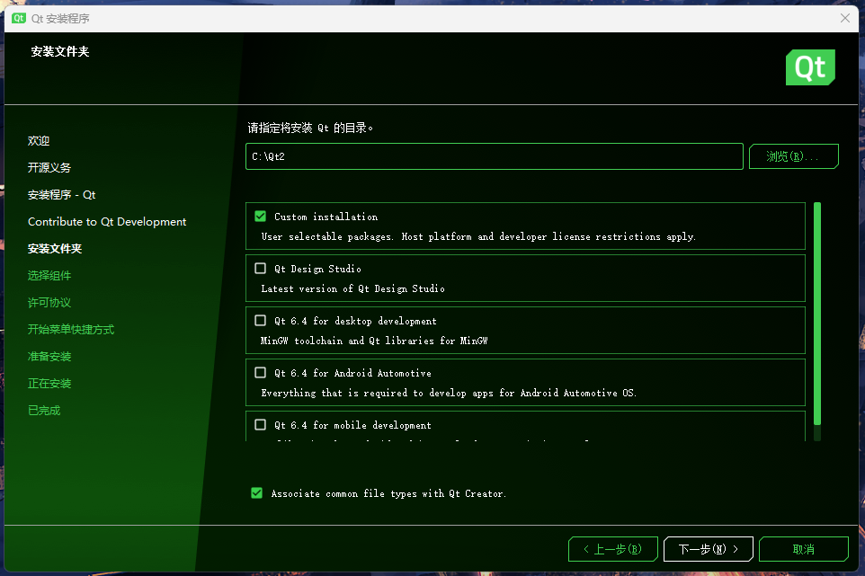
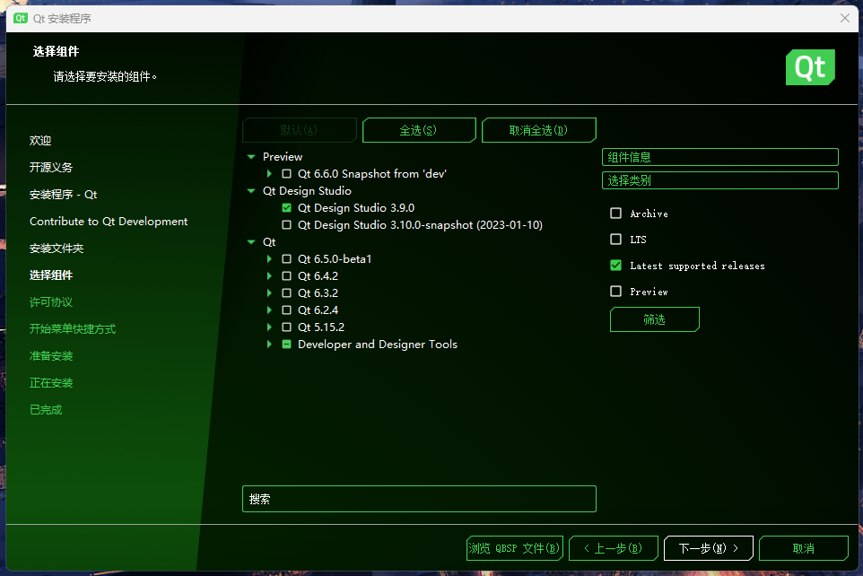
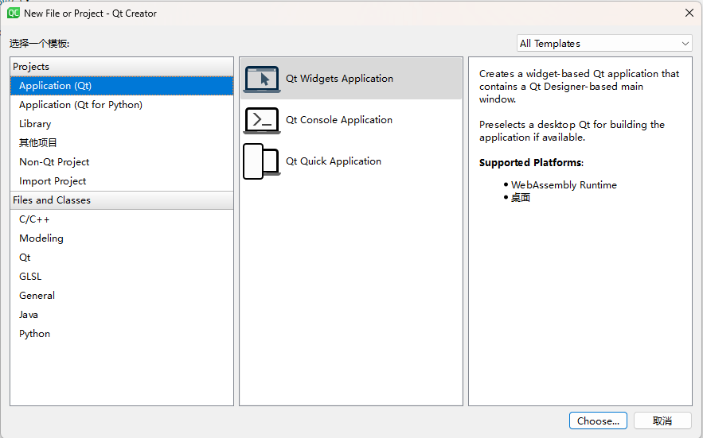
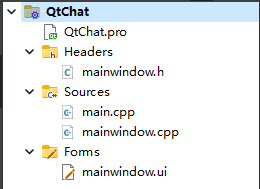
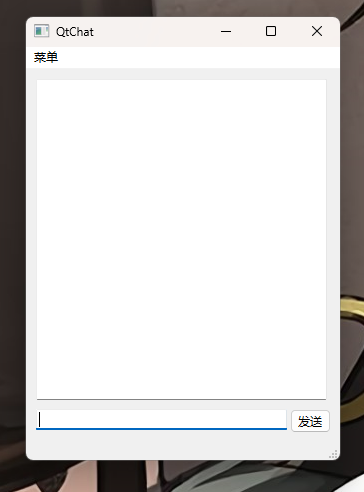
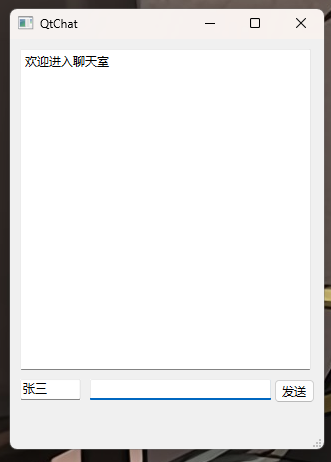

## Qt 简介

在告别命令行程序后，我们迎来的便是 GUI 程序，或称图形用户界面程序。

要编写 GUI 程序，首先我们需要选择一个开发框架以帮助我们包装图形化的功能，让我们能一行代码画出一个按钮之类的控件，同时处理点击等事件。在 C++ 语言中，满足跨平台的最常见选择就是 Qt 了。所谓跨平台即同一份代码，可以编译出 Windows, Mac 和 Linux 下的桌面程序。

### Qt 教程推荐

[《Qt 5.9 C++开发指南》2021](https://www.bilibili.com/video/BV1AX4y1w7Nt) P1-P8：个人推荐，任务驱动，通俗易懂

> 如果使用这个教程，建议去补充一下 Qt6 的信号槽函数指针写法

[Qt6.3.1 C++ GUI开发教程](https://www.bilibili.com/video/BV1G94y1Q7h6)：同一个人的新版本教程，废话太多

[Qt6官方文档](https://doc.qt.io/qt-6)

### 其他GUI框架

| 框架         | 语言       | 跨平台  | 例子        |
| ------------ | ---------- | ------- | ----------- |
| Qt           | C++        | 是      | WPS,YY 语音 |
| MFC          | C++        | Windows | ——          |
| PyQt         | Python     | 是      | ——          |
| Tkinter      | Python     | 是      | ——          |
| Electron     | JavaScript | 是      | VSCode      |
| SWing,JavaFX | Java       | 是      | ——          |

> 大企业往往喜欢自研框架，自己造轮子，比如QQ

## Qt 安装

Qt 是一个商用软件，但如果用于开源软件开发，则可以使用他们的 [Qt for Open Source Development](https://www.qt.io/download-open-source)

进入官方网页后，下拉找到 **Download the Qt Online Installer**

一路下一步之后来到安装文件夹的选择



这里，直接选择 `Qt Design Studio` 和 `Qt 6.* for desktop development` 就可以了，之后就继续疯狂下一步。



如果你的硬盘空间捉襟见肘，你可能得研究一下这里面哪些可以不装。上一步不改默认选项，下一步就会来到选择组件，选择一个 `Qt 6.*` 的版本打开下拉框，在里面选择你要的组件。

## 如何开始

1. 任何时候官方文档([Getting Started with Qt](https://doc.qt.io/qt-6/gettingstarted.html))都是最佳选择。

2. 在 Qt 中使用 F1 可以打开选中元素的官方文档。

### 创建一个新项目

菜单栏 -> 文件 -> 新建文件或项目 -> Qt Widgets Application



重点：Build System 我建议用 qmake，可以省去大量麻烦。但如果你想在 VS/VSCode 上开发，且掌握 CMake，愿意学习怎么在 Qt 里用，那你可以选择后者。

这里我创建了一个叫 QtChat 的项目，创建完会得到如下的目录结构。



### 认识 pro file

如果你创建文件不是通过 Qt 操作的，而是在文件管理器里直接添加，你会发现这个文件不在 Qt Creator 中显示。类似的情况还会出现在你想使用图片素材时。

这些都需要通过配置 pro 文件来处理。使用 Qt Creator 有时候会帮你处理这一步。

[Qt pro文件详解](http://c.biancheng.net/view/9428.html)

[如何添加图片资源](https://blog.csdn.net/qq_45790916/article/details/128260370)

### 认识 ui file


双击打开 ui 文件，左边是控件库，可以拖拽到界面中。右下角是选中控件的其他属性。

这里我放了一个 `Plain Text Edit`，用来显示聊天记录，`Line Edit` 用来输入消息，`Push Button` 用来发送消息。

这是放置控件的第一种方法。

记住，良好的命名是个好习惯，在右下角修改控件的 objectName。

### 构建 and 运行

运行：左下角 -> 运行

> 默认会在运行前构建一次，但这样没法双开应用，可以把 工具 -> 选项 -> 构建和运行 -> 在运行前都是先部署 关掉，然后手动构建和运行。等到测试网络功能的时候，这是必要的。
>
> 构建：菜单栏 -> 构建 -> 构建项目 "xxx"



## 控件

### 使用控件

刚刚我们已经创建了一个界面，我们现在尝试在源代码里面使用他们。

我们在主界面的构造函数中加入几行代码。

`mainwindows.cpp`

```cpp
#include "mainwindow.h"
#include "ui_mainwindow.h"

MainWindow::MainWindow(QWidget *parent)
    : QMainWindow(parent)
    , ui(new Ui::MainWindow)
{
    ui->setupUi(this);
    
    // display welcome infomation
    ui->chatHistoryEdit->appendPlainText(QString("欢迎进入聊天室\n"));
    // read only
    ui->chatHistoryEdit->setReadOnly(true);
    // 焦点移到发送框中
    ui->chatEdit->setFocus();
}

MainWindow::~MainWindow()
{
    delete ui;
}
```

> 每个控件具有什么功能，最好的手册就是 F1。


### 用代码创建控件

通过 ui 文件创造的控件会被构造在一个名为 ui 的对象中。正如代码所示，我们所有的访问会借由这个 ui 指针去访问。

另外一种创建方法就是直接在代码中创建，对于数量大或不定的控件，选择这种方式会方便得多。

`mainwindows.h`
```cpp
#ifndef MAINWINDOW_H
#define MAINWINDOW_H

#include <QMainWindow>
#include <QLineEdit>

QT_BEGIN_NAMESPACE
namespace Ui { class MainWindow; }
QT_END_NAMESPACE

class MainWindow : public QMainWindow
{
    Q_OBJECT
    
    //...

    // create a usernameEdit
    QLineEdit *usernameEdit;
};
#endif // MAINWINDOW_H
```

`mainwindows.cpp`
```cpp
#include "mainwindow.h"
#include "ui_mainwindow.h"
#include <QtDebug>

MainWindow::MainWindow(QWidget *parent)
    : QMainWindow(parent)
    , ui(new Ui::MainWindow)
{
    //...

    // usernameEdit
    this->usernameEdit = new QLineEdit(this);
    this->usernameEdit->setGeometry(10,ui->chatEdit->y(),61,21);
    this->usernameEdit->setText(QString("张三"));
    this->usernameEdit->show();
    qDebug()<<this->usernameEdit->geometry() << " "<< this->ui->chatEdit->geometry();
}

MainWindow::~MainWindow()
{
    delete ui;
}
```

以上，创建了一个编辑框用于输入用户名。

> 自己创建的控件要多一步 `object->show()` 才能显示



## 信号槽

要想实现按钮点击等操作，我们需要使用 Qt 提供的信号槽机制。

本质上信号和槽都是一个函数，信号槽就是 Qt 设计了一个方法可以让一个函数的执行触发执行另一个函数的执行

首先，我们先编写一个发送信息到聊天记录框的函数作为槽。

```cpp
bool MainWindow::send(){
    QString text = this->ui->chatEdit->text();
    QString username = this->usernameEdit->text();
    QDateTime current;
    QString time = current.currentDateTime().toString("MMM dd hh:mm::ss");
    QString data = time + " " + username + "\t" + text;
    this->ui->chatEdit->setText("");
    if(text == ""){
        return false;
    }
    qDebug()<<data;
    this->ui->chatHistoryEdit->appendPlainText(data+"\n");
    return true;
}
```

然后利用 connect 函数把点按钮和发消息连接在一起

`connect(this->ui->sendButton,&QPushButton::clicked,this,&MainWindow::send);`

也就是当 `this->ui->sendButton` 调用 `QPushButton::clicked` 这个函数时，调用 `this` 的 `MainWindow::send`。

> `QPushButton::clicked` 是 Qt 定义好的信号，会由 Qt 在每次点击时调用，类似的预定义的信号还有很多，你需要用 F1 去查看
>
> 同时你也可以自定义信号，具体见网上的教程

注意这种写法传的是函数指针，还有其他的写法，但这里不赘述。

连接的时机任意，一般是构造函数里写。

```cpp
MainWindow::MainWindow(QWidget *parent)
    : QMainWindow(parent)
    , ui(new Ui::MainWindow)
{
    ...
    connect(this->ui->sendButton,&QPushButton::clicked,this,&MainWindow::send);
}
...
```


## 网络功能

常见的网络协议有 HTTP, TCP, UDP 等，本次我们使用的是封装后的TCP协议

我们提供了一个二次封装的网络库在 [`/network/src`](../../network/src/) 下

接口文档见 [`/doc/api.md`](../../network/doc/api.md)

我们用 [QtNetworkDemo](hhttps://github.com/panjd123/QtNetworkDemo) 来演示怎么使用这套网络接口

### 其他重要说明

1. 因为网络接口引用了Qt的网络功能，所以你需要在 `pro` 文件中加上一行 `QT+=network`
2. `NetworkSocket::hello` 是非阻塞的，换言之，网络连接和主程序是并行的关系，所以如果 `hello` 完马上通信会报错未连接，要解决这个问题你需要紧接着调用基类的一个函数 `socket->base()->waitForConnected();` 让线程停在这等，但这一步具体是否需要，看你的实现。
3. 网络接口文件是外部导入的，要在 Qt Creator 中显示，不要忘记修改 `pro` 中的 `SOURCES` 和 `HEADERS`

### QtNetworkDemo

这个 demo 实现了客户端和服务端连接，客户端向服务端发送信息，服务端向最后一次通信的客户端发送信息的功能。

要运行这个项目，你需要双开软件，前面提到过方法。

阅读这份代码，理解服务器和客户端之间如何交互的。

### 拓展阅读

[一些重要的网络协议介绍](https://www.cnblogs.com/fzz9/p/8964513.html)
